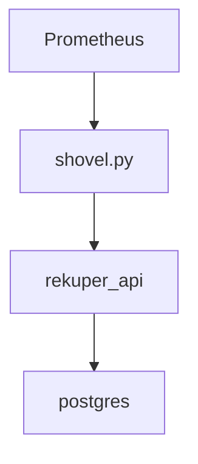

<p align="center">
    
</p>
ЯƎKUPER is a simple Flask app that provides HTTP API with a database, for keeping track of testing lab resource utilization across test atuomation sessions.
The utility, `shovel` script is designed to extract the resource information by scraping TSDB (prometheus) metrics and pushing the processed data to `rekuper` database by calling its API endpoints. It can be regularly called by `cron` or spawned as a OSP `cron job` pod.



##Setup
This is a standard flask app that utilizes [Flask-migrate](https://flask-migrate.readthedocs.io/en/latest/index.html) ([sqlalchemy](https://www.sqlalchemy.org/) + [alembic](https://alembic.sqlalchemy.org/en/latest/)).
It requires a database to be set up.
To set it up, use the initialization script - `scripts/db_init/init-user-db.sh`.
For a testing setup, you can setup a postgres db container with the schema precreated by running the `scripts/db_init_setup_db.sh` script.

Add your database connection configuration to the `settings.yaml` file. You can use the `settings.yaml.template` for start:
```
cp settings.yaml{.template,}
```
apply the migrations so the DB schema is up-to-date:
```
flask --app rekuper db upgrade
```
start the app:
```
flask --app rekuper run
```
The server uses port `5000` by default. The swagger UI should be accessible as a root page.

## Container setup
Build the image
```
podman build -t localhost/rekuper:0.1 .
```

Assumuing the database is also going to be run as local container:
```
# prepare common network
podman network create rekuper
```
```
# start db (ephemeral storage) container
podman run \
    --name rekuper_db \
    --network rekuper \
    -e POSTGRES_PASSWORD=changeme \
    -v ./init-user-db.sh:/docker-entrypoint-initdb.d/init-user-db.sh:z \
    postgres:17
```
> [!IMPORTANT]
> At this point, you started an unitialized database. You have to initialize it by running the migration scripts. For this purpose, we'll run a 1-shot `rekuper` container and override the default command
>This should be use also on an initialized db every time there is a new migration.
```
podman run \
    --rm \
    --name rekuper_migrate \
    --network rekuper \
    -p 5000:5000 \
    -e REKUPER_DATABASE__HOST=rekuper_db:5432 \
    -e REKUPER_DATABASE__DB=telemetry \
    -e REKUPER_DATABASE__USERNAME=postgres \
    -e REKUPER_DATABASE__PASSWORD=changeme \
    localhost/rekuper:0.1 \
    flask --app rekuper db upgrade
```
Run the rekuper container properly this time
```
podman run \
    --network rekuper \
    -p 5000:5000 \
    -e REKUPER_DATABASE__HOST=rekuper_db:5432 \
    -e REKUPER_DATABASE__DB=telemetry \
    -e REKUPER_DATABASE__USERNAME=postgres \
    -e REKUPER_DATABASE__PASSWORD=changeme \
    localhost/rekuper:0.1
```
