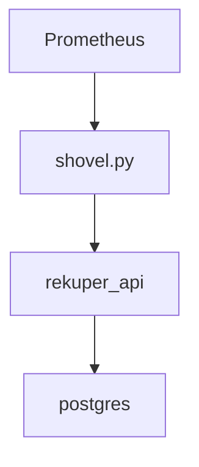

# rekuper
A simple HTTP API with a database, for keeping track of testing lab resource utilization across test atuomation sessions.
The utility, `shovel` script is designed to extract the resource information by scraping TSDB (prometheus) metrics and pushing the processed data to `rekuper` database by calling its API endpoints. It can be regularly called by `cron` or spawned as a OSP `cron job` pod.



##Setup
This is a standard flask app that utilizes Flask-migrate (sqlalchemy + alembic).
It requires a database to be set up.
To set it up, use the initialization script - `scripts/db_init/init-user-db.sh`.
For a testing setup, you can setup a postgres db container with the schema precreated by running the `scripts/db_init_setup_db.sh` script.

Add your database connection configuration to the `settings.yaml` file. You can use the `settings.yaml.template` for start:
```
cp settings.yaml{.template,}
```
apply the migrations so the DB schema is up-to-date:
```
flask --app rekuper db upgrade
```
start the app:
```
flask --app rekuper run
```
The server uses port `5000` by default. The swagger UI should be accessible as a root page.
